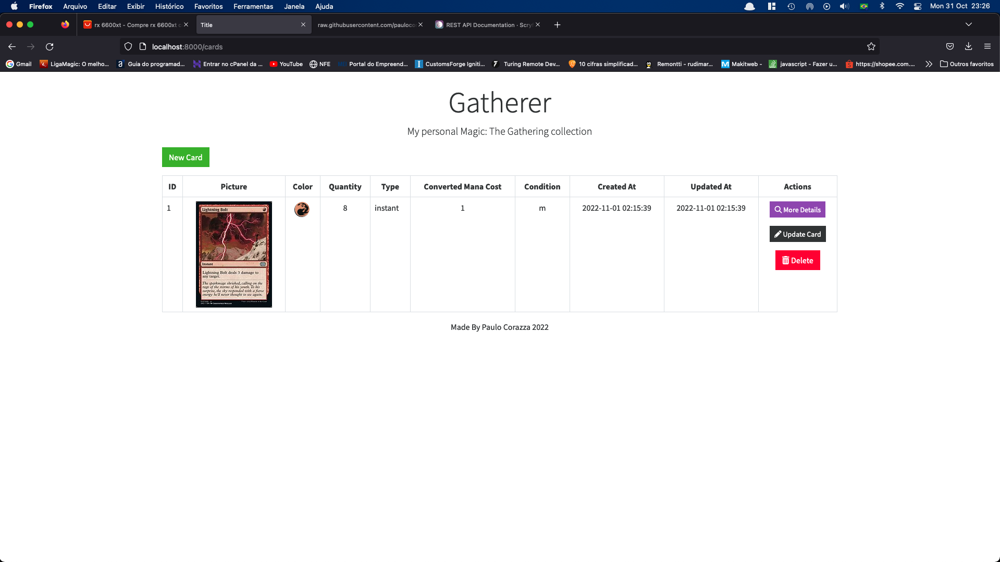
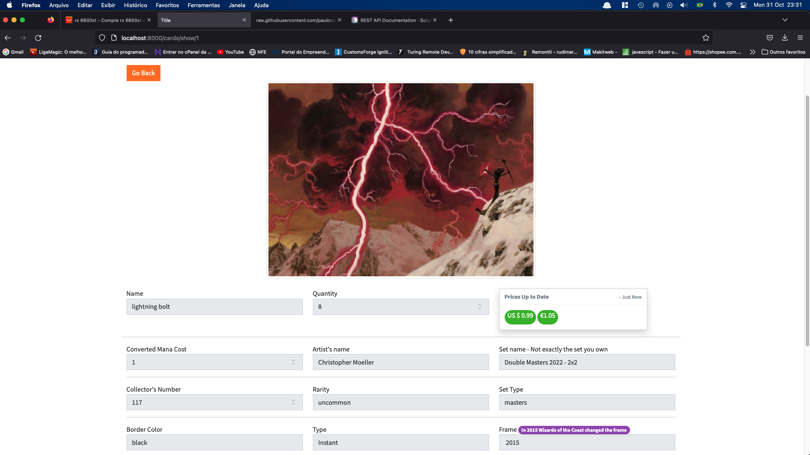
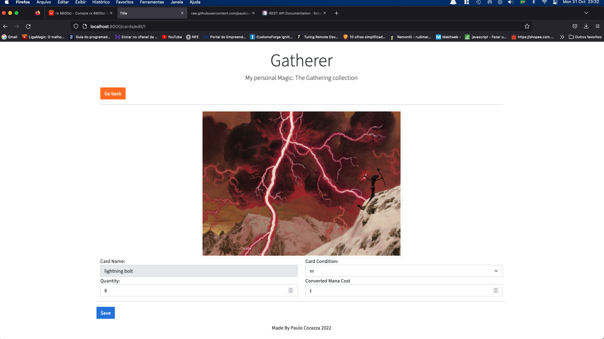
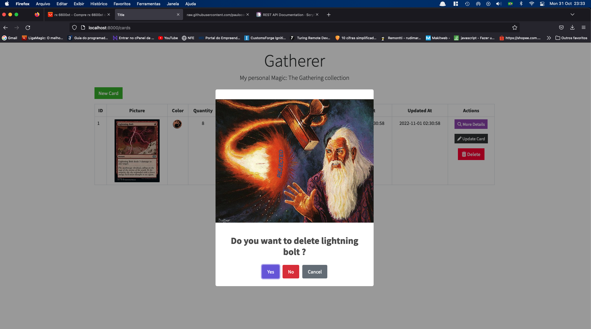

## About Laravel

Laravel is a web application framework with expressive, elegant syntax. We believe development must be an enjoyable and creative experience to be truly fulfilling. Laravel takes the pain out of development by easing common tasks used in many web projects, such as:

- [Simple, fast routing engine](https://laravel.com/docs/routing).
- [Powerful dependency injection container](https://laravel.com/docs/container).
- Multiple back-ends for [session](https://laravel.com/docs/session) and [cache](https://laravel.com/docs/cache) storage.
- Expressive, intuitive [database ORM](https://laravel.com/docs/eloquent).
- Database agnostic [schema migrations](https://laravel.com/docs/migrations).
- [Robust background job processing](https://laravel.com/docs/queues).
- [Real-time event broadcasting](https://laravel.com/docs/broadcasting).

Laravel is accessible, powerful, and provides tools required for large, robust applications.

## About Gatherer

Gatherer is a Laravel app to save your entire  Magic:The gathering in an application.

It uses the scryfall api to fetch some data, like card pictures, prices, articles, decks.
- [Scryfall](https://scryfall.com/docs/api).

For dialogs i am using sweet alert 2.
- [SweetAlert2](https://sweetalert2.github.io/)

For now, the only feature available are a CRUD for the cards, but i am working on new features.

## index

## show

## update

## delete

The Laravel framework is open-sourced software licensed under the [MIT license](https://opensource.org/licenses/MIT).
# laravel-gatherer

## Initialization

git clone
composer install
Set up your database 
php artisan migrate
php artisan serve

app is running on localhost:8000

